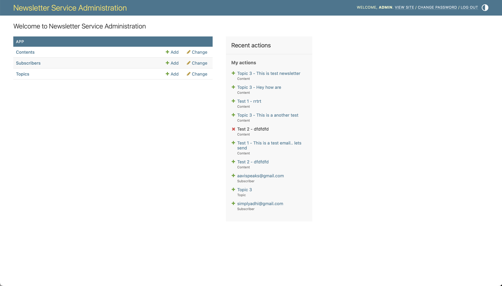
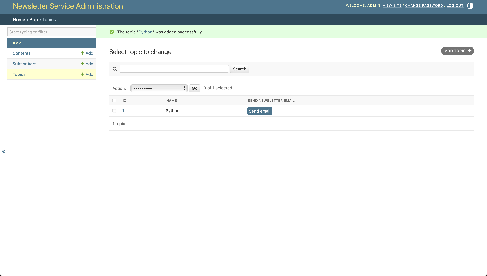

# newsletter-service
Developed using Python (3.13), Django & SQLite (db), brevo (SMTP), pythonanywhere (hosting provider)

App is live in https://pyadhi.pythonanywhere.com/admin/ and the admin panel can be accessed using the username/password shared in mail.

## How to run?
- Clone this repo and open in terminal.
- Create a virtual env `python -m venv venv` (only first time)
- Activate virtualenv `source venv/bin/activate`
- Install requirements `pip install -r requirements.txt` (only first time)
- Run server `python manage.py runserver`

## Running unit tests

- Activate virtualenv `python -m venv venv`
- Run `python -m pytest app/tests`
- The tests mock email sending behaviour and covers various scenarios of sending email including happy path and edge cases.

## Accessing the UI
- Run this command to create a superuser as it required to access Django admin which is an inbuilt cms utility provided by Django to manage database models without writing code or with minimal code.
- The project heavily uses django admin to add Topic, Content, Subscribers.
- `python manage.py createsuperuser` - follow the onscreen instructions to create username and password
- Server starts running in port 8000. Hit http://localhost:8000/admin and use the username and password you created previously and you will be able to see an UI like this

## Assumptions

- My goal was to keep everything simple. This is because since this project also needs to be deployed, having many moving parts like database, cache or message queues will be too complex for now.
- SQLite is used as the primary source of truth because it is light weight and can be created inside the server where the app is running. If we opt for postgres or mysql, we need to use cloud providers when the app gets deployed.
- Based on the assumption data will always be structured in this project, NOSQL is not used.
- The goal was to write minimal boiler plate code by making heavy use of Django default features and the total custom lines of code added is within 200. This is the reason behind choosing Python & Django because it allows to create production ready prototypes in a very quick period.

## How the app works?

- The app has 3 db tables that are mapped to Python models Topic, Content and Subscriber.
- We need to create topic first. Topic can be created by visiting this url (https://pyadhi.pythonanywhere.com/admin/app/topic/)
- After creating topic, we need to add subscribers who are listening to that topic. Subscribers can be added using the url https://pyadhi.pythonanywhere.com/admin/app/subscriber/
- Once atleast one topic and one subscriber is added in the system, we can start creating content which will be used to send email.
  - 
- The easiest way to create a content in a topic is to visit all topics page (https://pyadhi.pythonanywhere.com/admin/app/topic/) and click **Send Email** button corresponding to each topic. Clicking this button will prepopulate all the topic subscribers in the content add page. But if a content is added directly without clicking Send Email from topic, subscribers won't be pre-populated and the app will run into errors. In order to keep things very simple I have kept workflow like this.
- Once a content is added, there is a background job running in pythonanywhere that scans this Content table for all content that needs to be sent within current time. Then those content will be delivered to subscribers. Due to limitations of the pricing plan in pythonanywhere and to keep things simple, I have configured the background job to run every 60 seconds, so there might be some delays in sending emails.

## Directory structure

## Limitations

- Only 300 emails can be sent per day (because of the limitations and pricing plan of the smtp provider). Currently I am not tracking how many emails sent per day.
- The system does not have any tangible logs. 
- No monitoring is added.
- Emails that are sent successfully and emails that failed are also not logged. Currently this can be inferred from is_sent & sent_at fields of Content table.
- The app can also be dockerized with postgres/mysql, message queue, background job runner. But it requires us to use aws or gcp which further increases complexity.
- Retry mechanism is not robust. If a content fails n time, we need to prevent that from being retried. But this is not being done currently. Retry sending failed content is currently infinite.

## How to scale this?

- Since moving parts are very less, the app will be able to handle fair amount of traffic without any changes in the existing deployment setup. The current app is vertically scalable. But we need the following to make the app horizontally scalable.
- We can add a message queue (Django celery). Whenever we add a content, a message can be pushed to queue. The consumer will pick up the message and decide whether to send or not. Using message queues will make our app more extensible when we want to introduce any other background jobs apart from email sending in future. This will also improve our retry mechanism which can be configured in message queues and if a content fails repeatedly we can add it to dead letter queue after n retries for later analysis.
- SQLite is also not scalable. We need to use proper SQL database  like postgres. The current project will work with postgres without any actual code changes. We just need to migrate data and change the connection details.

## REST Endpoints

- Apart from UI based access, content, topic and subscribers can be created using REST endpoints also.

